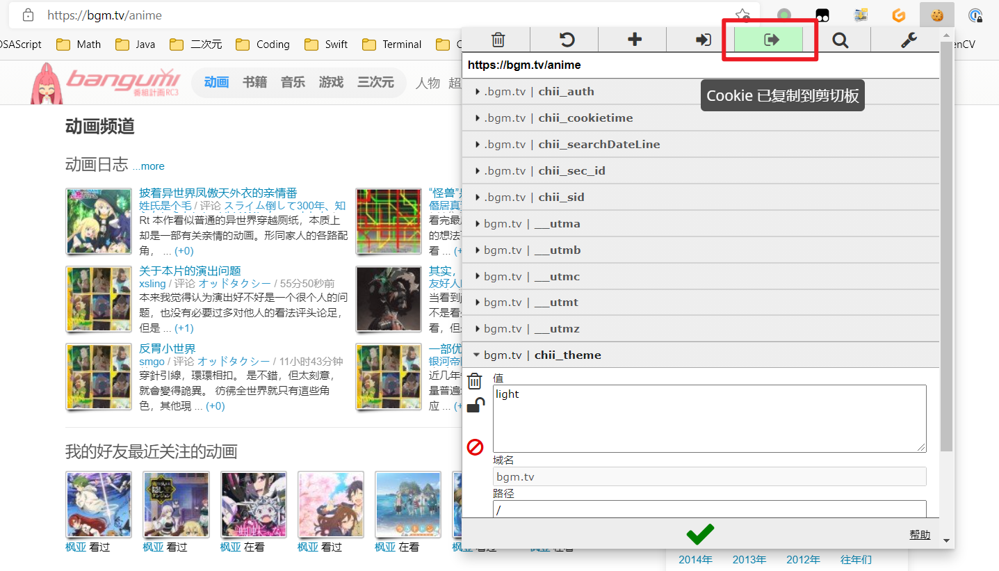

# 0x00 Bangumi Spider [Project Nichijou]

本项目作为项目[Project Nichijou](https://github.com/project-nichijou)中的子项目，是[Bangumi 番组计划](bgm.tv)的爬虫，用于构建番剧数据库。完整内容详见: https://github.com/project-nichijou/intro

- [0x00 Bangumi Spider [Project Nichijou]](#0x00-bangumi-spider-project-nichijou)
	- [思路与流程](#思路与流程)
	- [关于爬虫](#关于爬虫)
	- [环境](#环境)
	- [配置方法](#配置方法)
	- [使用方法](#使用方法)
	- [关于数据库](#关于数据库)
	- [关于脚本](#关于脚本)
	- [一些其他奇奇怪怪的点](#一些其他奇奇怪怪的点)
	- [TODO](#todo)
	- [Change log](#change-log)

## 思路与流程

本repo只包含：
- 数据爬取
- 写入数据库

如果阅读代码可以发现，我们对于大量难以处理的字段使用了直接写入`HTML`的方式，会在后续的流程中 (见[项目架构](https://github.com/project-nichijou/intro)) 进行处理。这样做的原因在于：

1. 提高爬虫速度 (毕竟服务器是小水管 1C2G)
2. 降低在爬取阶段的报错、解析失败、写入失败频率
3. 有利于提高整体工作的稳定性，方便调试
4. 降低数据库复杂度，方便维护

## 关于爬虫

本项目实现了如下Spider:

- `bangumi_anime_list`: 爬取动画列表, `/anime/browser/?sort=title&page=<page>`
- `bangumi_book_list`: 爬取书籍列表, `/anime/book/?sort=title&page=<page>`
- `bangumi_game_list`: 爬取游戏列表, `/anime/game/?sort=title&page=<page>`
- `bangumi_music_list`: 爬取音乐列表, `/anime/music/?sort=title&page=<page>`
- `bangumi_real_list`: 爬取三次元列表, `/anime/real/?sort=title&page=<page>`
- 下面两个蜘蛛是一组 (需要注意使用的先后顺序, 这两个蜘蛛囊括了原来的`bangumi_anime_episode`, `bangumi_anime_episode_intro`, `bangumi_anime`)
  - `bangumi_anime_api`: 爬取[API](https://github.com/bangumi/api)提供的番剧信息
    - 名称
    - 中文名
    - 简介
    - 话数
    - 放送开始日期
    - 放送星期
    - 封面图 (默认: 大)
    - 评分
    - 站内排名
    - 剧集详细信息
  - `bangumi_anime_scrape`: 爬取网页上的番剧信息 `/subject/<sid>`
      - 所有属性列表 (HTML)
      - 标签 (空格隔开)
      - 种类 (TV, OVA, ...)

因为主项目的性质，故主要精力集中在番剧上面，如果您有其他需要可以自行实现 (欢迎提交PR！)

## 环境

- MySQL 5.7.4 +
- Python 3.6 +
- Scrapy
- beautifulsoup4
- Ubuntu (WSL)
- click (optional, 用于构建CLI)
- mysql-connector-python

一键安装依赖:

```
pip3 install -r requirements.txt
```

## 配置方法

本项目有两个配置文件：
- `bangumi/config/bangumi_settings.py`
- `cookies.json`

可以发现这两个文件在本`repo`中只有`_template`，需要将这两个`template`配置好并复制、重命名。

关于配置字段的具体含义，文件中都有注释，可以自行查阅。

注意：`cookies.json`中的`cookies`在某些情况下需要以下字段 (已经写在`template`当中了)，~~否则无法爬取特殊内容~~，但是我们仍然建议把整个`cookies`都复制进来:

```
{
	"chii_auth": <value>,
	"chii_sec_id": <value>,
	"chii_sid": <value>
}
```

注意：`chii_sid`由于会被Bangumi定期替换，所以我们手动实现了`cookies`变更持久化。当然，即便这样我们在爬取的时候还是有可能失效，毕竟我们只能停留在对机制的猜测阶段。是否开启`cookies`持久化可以在`bangumi/config/bangumi_settings.py`中的`COOKIES_AUTO_UPDATE`当中设置。如果开启，建议复制一份`cookies.json`保存为`cookies.json.backup`，因为文件会被复写，备份以便不时之需。

注意 (~~怎么又来了~~)：**关于`cookies.json`的格式**：支持`list`和`dict`的两种格式。

上面的是`dict`，下面的是`list`举例：

```json
[
	{
		"domain": ".bgm.tv",
		"expirationDate": 1627660426.06073,
		"hostOnly": false,
		"httpOnly": false,
		"name": "chii_auth",
		"path": "/",
		"sameSite": "unspecified",
		"secure": false,
		"session": false,
		"storeId": "0",
		"value": "<value>",
		"id": 1
	},
	// 略...
]
```

推荐使用`list`配置`cookies.json`，不容易抽风。方法：可以使用类似于[EditThisCookie](https://www.editthiscookie.com/)的插件进行导出，见下图。



## 使用方法

经过考量，不准备使用`scrapyd`或者写启动服务器之类的功能，这里只提供了可以用于定时执行的脚本以及`main.py`的CLI工具。我们计划在以后统一实现后端整个工作流的控制管理，不在这里单一实现。目前，可以直接通过以下命令启动爬虫：

```
scrapy crawl <spider_name>
```

`<spider_name>`即为蜘蛛的文件名，位于`bangumi/spider/`目录下。

注意：对于部分蜘蛛，如`bangumi_anime`，有额外的参数。如果需要传参，请使用如下命令：

```
scarpy crawl <spider_name> -a <arg1>=<val1> <arg2>=<val2> ...
```

比如：

```
scrapy crawl bangumi_anime -a fail=off
```

或者也可以使用CLI命令：

- 主命令
	```
	python3 main.py 
	Usage: main.py [OPTIONS] COMMAND [ARGS]...

	Options:
	--help  Show this message and exit.

	Commands:
	crawl       start SPIDER crawling using scrapy
	dellog      delete loggings in the database.
	initdb      init bangumi database
	setcookies  set cookies of bangumi
	```
- `crawl`
	```
	python3 main.py crawl --help
	Usage: main.py crawl [OPTIONS] SPIDER

	start SPIDER crawling using scrapy

	SPIDER: name of the spider to start

	Options:
	--fail INTEGER  time of retrying for failed items. default is 0, when the
					value is negative, retrying won't stop unless the table
					`request_failed` is empty. Note: this parameter is not
					available for all spiders, only for `bangumi_anime_api`,
					`bangumi_anime_scrape`.
	--help          Show this message and exit.
	```
- `dellog`
	```
	python3 main.py dellog --help
	Usage: main.py dellog [OPTIONS]

	delete loggings in the database.

	Options:
	--before TEXT  delete the loggings which are before the time in the   
					database. default is None, which means delete all. data
					format: YYYY-MM-DD hh:mm:ss
	--help         Show this message and exit.
	```
- `setcookies`
	```
	python3 main.py setcookies --help
	Usage: main.py setcookies [OPTIONS] COOKIES

	set cookies of bangumi

	COOKIES: dictionary of cookies (converted to str)

	Options:
	--help  Show this message and exit.
	```

## 关于数据库

本项目目前使用MySQL作为数据库，更多的数据库日后~~可能~~会进行支持，如果有兴趣可以提交PR，持续关注。

此外，当前的默认数据库名称为`bangumi`，本工具会自动新建数据库以及数据表 (若不存在) 。如果和本地数据库名称有冲突，可以在`bangumi/database/database_settings.py`中修改。

下面为各张`table`的定义语句:

```sql
CREATE TABLE IF NOT EXISTS `bangumi_id` (
	`sid`		INT UNSIGNED NOT NULL,	# 条目ID
	`type`		VARCHAR(10) NOT NULL,	# 种类: anime, book, etc.
	`name`		VARCHAR(200) NOT NULL,	# 原名
	`name_cn`	VARCHAR(200) NOT NULL,	# 中文名 (没有就是原名)
	PRIMARY KEY ( `sid` ),
	UNIQUE KEY ( `sid` )
) ENGINE=InnoDB CHARSET=utf8
```

```sql
CREATE TABLE IF NOT EXISTS `bangumi_anime` (
	`sid`		INT UNSIGNED NOT NULL,	# 条目ID
	`name`		VARCHAR(200) NOT NULL,	# 原名
	`name_cn`	VARCHAR(200) NOT NULL,	# 中文名 (没有就是原名)
	`summary`	LONGTEXT,				# 简介
	`eps_count`	INT,					# 话数
	`date`		VARCHAR(200),			# 放送开始日期
	`weekday`	INT,					# 放送星期
	`metaHTML`	LONGTEXT,				# 所有属性列表 (HTML)
	`tags`		LONGTEXT,				# 标签, 空格隔开
	`type`		VARCHAR(10),			# 种类: TV, OVA, ...
	`image`		LONGTEXT,				# 封面图, large > common > medium > small > grid
	`rating`	DECIMAL(32,28),			# 评分, rating.score
	`rank`		INT,					# 站内排名
	PRIMARY KEY ( `sid` ),
	UNIQUE KEY ( `sid` )
) ENGINE=InnoDB CHARSET=utf8
```

```sql
CREATE TABLE IF NOT EXISTS `bangumi_anime_name` (
	`sid`		INT UNSIGNED NOT NULL,	# 条目ID
	`name`		VARCHAR(200) NOT NULL,	# 名称
	PRIMARY KEY ( `sid`, `name` )
) ENGINE=InnoDB CHARSET=utf8
```

```sql
CREATE TABLE IF NOT EXISTS `bangumi_anime_episode` (
	`eid`		INT UNSIGNED NOT NULL,	# 剧集ID
	`sid`		INT UNSIGNED NOT NULL,	# 条目ID
	`name`		VARCHAR(200) NOT NULL,	# 剧集标题
	`name_cn`	VARCHAR(200) NOT NULL,	# 中文标题 (没有就是标题)
	# 类型: 本篇 0 / SP 1 / OP 2 / ED 3 / 预告,宣传,广告 4 / MAD 5 / 其他 6
	`type`		INT UNSIGNED NOT NULL,
	`sort`		INT UNSIGNED NOT NULL,	# 顺序 (当前type中的多少话)
	`status`	VARCHAR(10) NOT NULL,	# 是否已放送 状态: Air / NA / Today
	`duration`	VARCHAR(200) NOT NULL,	# 时常, e.g. 24m
	`date`		VARCHAR(200) NOT NULL,	# 放送日期
	`desc`		LONGTEXT,				# 简介
	PRIMARY KEY ( `eid` ),
	UNIQUE KEY ( `eid` )
) ENGINE=InnoDB CHARSET=utf8
```

```sql
CREATE TABLE IF NOT EXISTS `request_failed` (
	`id`		INT UNSIGNED NOT NULL,	# 失败ID
	`type`		VARCHAR(20) NOT NULL,	# 失败种类
	`desc`		LONGTEXT,				# 失败信息
	PRIMARY KEY ( `id`, `type` )
) ENGINE=InnoDB CHARSET=utf8
```

```sql
CREATE TABLE IF NOT EXISTS `log` (
	`time`		VARCHAR(20) NOT NULL,	# 日志时间
	`content`	LONGTEXT				# 日志内容
) ENGINE=InnoDB CHARSET=utf8
```

注：因为一些变态数据，所以`duration`和`date`的长度已调整至200

## 关于脚本

可以发现，在仓库的根目录我们还提供了下面的脚本:
- `run.sh`

之所以提供脚本其实是因为`scrapy`没有提供定位到特定目录开始任务的命令行参数选项...所以我们就手动实现一下咯。

此脚本自动按顺序启动下面三个蜘蛛:
- `bangumi_anime_list`
- `bangumi_anime_api`
- `bangumi_anime_scrape`

失败重试的次数设置为了两次，可以自行调整。

## 关于时长

此版本 (v0.2.1) 正常爬取一次的时常经测试为：
```
time consumed: 5285 seconds
```

测试平台：
- Ubuntu 18.04 LTS (WSL)
- 带宽：100 Mbps (10Mbps都打不到)
- U: AMD Ryzen 9 3900X

## 一些其他奇奇怪怪的点

- Bangumi自身数据有很大的可能性出问题，包括但不限于
  - 排行榜数据重复, 看[这里](https://bgm.tv/group/topic/363592), 和[这里](https://gyrojeff.top/index.php/archives/%E6%B5%8B%E8%AF%95%E5%B7%A5%E7%A8%8B%E5%B8%88%E9%9B%BE-%E7%88%AC%E5%8F%96%E7%95%AA%E7%BB%84%E8%AE%A1%E5%88%92%E6%97%B6%E9%81%87%E5%88%B0%E7%9A%84Bug/)
  - 官方API返回的数据字段缺失
  - 数据错误等
  - 某些奇怪的字段数据过长 (比如`date`, `duration`)
- 本项目中, `parse`出的所有结果一律使用`yield`, 不得使用`return`, 否则可能会出现无法进入`pipelines`的情况。原因不明，但是本项目中发生过这样有[一个很典型的例子](https://github.com/project-nichijou/bangumi-spider/commit/a1f67cc5fb8c6981802b84a1258e31ddf9a79044)

## TODO

- CLI【实现了记得要来README更新】
  - [x] 命令行使用`subprocess`替代
  - [x] `fail`重试次数设置
  - [x] `fail`无限重试
  - [x] 删除所有日志
  - [x] 删除截至某一时刻的日志
  - [x] 设置Cookies
- [x] CLI配套`bash`脚本
- [ ] `scrapy`最终结果写入日志
- [ ] `list`报告: `duplicate`总数 + 处理总数
- [x] `errback`函数格式调整
- [x] 数据库异常处理, 继续入数据库【递归啦 奇奇怪怪】
- [ ] 缩略图储存
- [x] 解决Cookies爆炸问题【尽力了，维护了私有cookies缓存机制】
- [ ] 引入私有缓存机制
  - [ ] 设置：各类数据的过期时间
  - [ ] 新建缓存数据库
  - [ ] 为`request_failed`新建`url`字段
  - [ ] 使用`status code`以及`failed`共同决定是否缓存
  - [ ] 使用`pickle`进行对象持久化
  - [ ] `process_request`, `process_response`重写

## Change log

- [v0.1.0](docs/v0.1.0.md)
- [v0.2.0](docs/v0.2.0.md)
